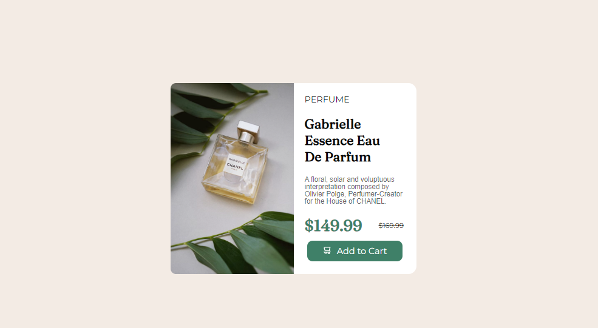

# Product Preview

## 📌 About ##
 

 Português:   
    Este projeto consiste em um cartão de visualização para uma loja de perfumes. No centro da tela, há um cartão dividido apresentando a foto do produto de um lado e, do outro lado, o nome do produto, descrição, valor promocional e um botão que leva à página de processamento de pagamento. Desenvolvido como um exercício para aprimorar habilidades em desenvolvimento web.

English:  
    This project consists of a visualization card for a perfume store. In the center of the screen, there is a split card featuring the product photo on one side and, on the other side, the product name, description, promotional value, and a button linking to the payment processing page. Developed as a practice exercise to enhance skills in web development.

## ⚒️ Tools 

- HTML5    
&nbsp;

- CSS3    
&nbsp;

## 💻 Preview <a href="https://pceraa.github.io/landingpag01/" target="_blank">🔗</a>

## 📃 License 

This project is under the MIT license. See the file [LICENSE](./LICENSE) for more details

